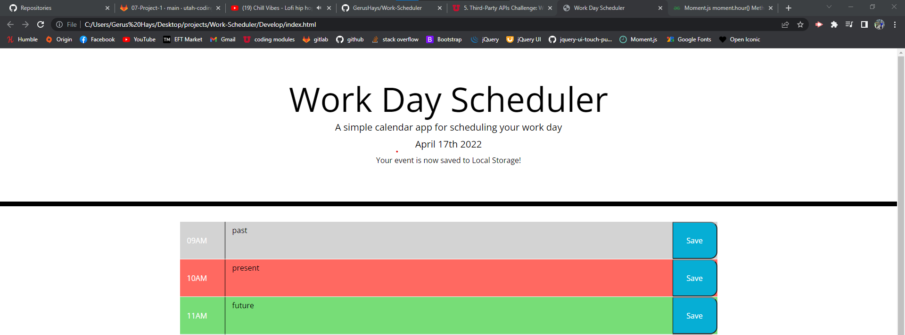

# Work Day Scheduler Starter Code
## Purpose
The purpose of this webpage is to create a "normal work day schedule" spanning from 9AM - 5PM.  
Upon opening the webpage the user is presented with the current day and 9 time block from 9-5pm in descending order.  
The user may enter in the text area just right of whatever time period they want to enter in an event for that time.  
Once they enter in the event in their selected timeblock they can select save so it wont go away if they were to close or refresh the webpage. 
They will also be presented with a message towards the top of the webpage that their event is saved in the local storage.  
The calendar also will display differently based on what time it is. If the current hour has passed then it will display gray. 
If the time is present then it will display red for the time block and if it is in the future the time block will display green.  
This calendar may be utilized for anyone with a busy day and needs a webpage to go to see what is up and coming or what has already passed.
## Built With
* HTML
* CSS
* JS

## Resources and Student cohesion
- https://www.geeksforgeeks.org/moment-js-moment-hour-method/ This weblink is where i got the function to check the current hour 
- I worked with William Grout, Andrea Rowland, Morgan Goodsell, Hiro, Valeria Garcia and Alex Lathrop while perfecting the HTML and Javascript for this code.
- We ended up using bits and pieces from eachothers code to make it our own. 

## Moving Forward
- I would like to add a calendar at the top to schedule things in the future as well

## Web link:
- My [website](https://gerushays.github.io/Work-Scheduler/)

## Screenshot

## Contribution
Made with ❤️ by Gerus Hays